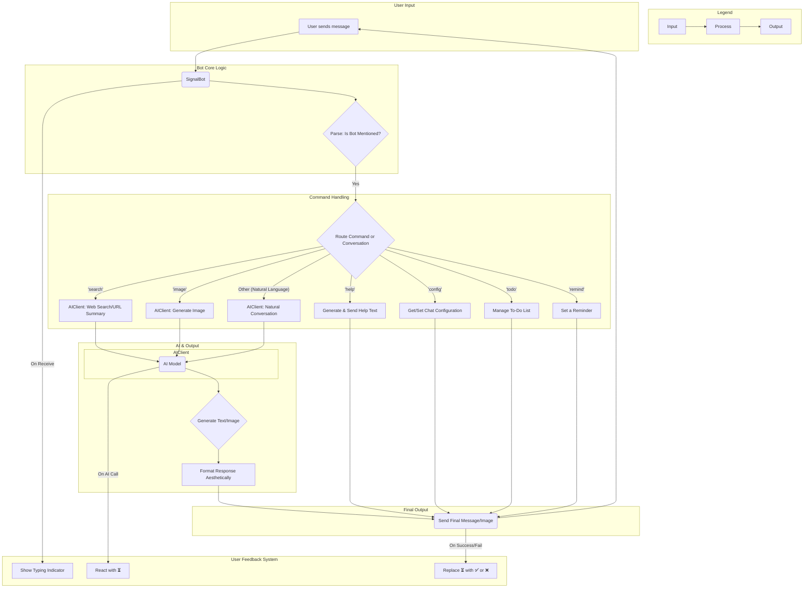

# Bot Interaction and Command Flow

This document outlines the user-bot interaction flow, command handling, and the strategy for managing conversational context. The system is designed around a single, unified interaction pattern: mentioning the bot by name.

## Visual Flowchart

The following diagram illustrates the lifecycle of a user's message, from input to the bot's final, aesthetically formatted response.



## Core Logic & Context Management

The bot's intelligence is rooted in a simple yet robust context management system: the **"Simple Log" model**.

For each chat, the bot maintains a `Context` object containing:

- **`history`**: A rolling log of the last 20 messages.
- **`config`**: The specific settings for that chat (`model`, `mode`, `prompt`).

When a user mentions the bot, the entire `history` log is sent to the AI, ensuring the bot has the immediate short-term context of the conversation. This approach is simple, predictable, and effective for most interactions.

## Command Reference

All interactions begin by mentioning the bot (e.g., `@BotName`). The bot's responses are designed to be visually aesthetic, using Markdown and emojis to create a clean and readable Text UI.

- **`help`**

  - **Purpose:** Displays a help message with a list of available commands.
  - **Example:**
    > **User:** `@BotName help`
    >
    > **Bot:**
    >
    > > 🤖 **Signal AI Assistant**
    > >
    > > > I'm a bot designed to assist you. Interact with me by mentioning my name (`@BotName`) followed by a command or a question.
    > >
    > > **Available Commands:**
    > >
    > > ```
    > > ┌
    > > ├─ 📋 todo      - Manage a shared to-do list.
    > > ├─ ⏰ remind    - Set a reminder.
    > > ├─ ⚙️ config    - Configure my settings for this chat.
    > > ├─ 🔎 search    - Search the web or summarize a URL.
    > > └─ 🖼️ image     - Generate an image from a prompt.
    > > ```
    > >
    > > _For more details, type `@BotName help <command>`._

- **`config`**

  - **Purpose:** Manages the bot's settings for the current chat.
  - **Example:**
    > **User:** `@BotName config view`
    >
    > **Bot:**
    >
    > > ⚙️ **Chat Configuration**
    > >
    > > > ```
    > > > model:  gemini-1.5-pro
    > > > mode:   mention
    > > > prompt: You are a helpful assistant.
    > > > ```
    > > >
    > > > _Use `@BotName config set <key> <value>` to make changes._

- **`todo`**

  - **Purpose:** Manages a simple to-do list within the chat.
  - **Example:**
    > **User:** `@BotName todo add Finalize the Q3 report`
    >
    > **Bot:**
    >
    > > ✅ **Todo added:** `1. Finalize the Q3 report`

- **`remind`**

  - **Purpose:** Sets a reminder for a user or the group.
  - **Example:**
    > **User:** `@BotName remind me in 10 minutes to check the build`
    >
    > **Bot:**
    >
    > > ✅ **Got it.** I will remind you at `6:13 PM` to "check the build".

## Onboarding Flow

When first added to a group, the bot will introduce itself with a welcome message to ensure users understand its purpose and how to interact with it.

> **Bot (upon joining a group):**
>
> > Hello everyone. I am a helpful assistant.
> >
> > You can interact with me by mentioning my name, `@BotName`.
> >
> > To see a full list of what I can do, just type:
> > `@BotName help`

## User Feedback System

A three-stage feedback system provides real-time updates for any AI-related task:

1.  A **typing indicator** is shown when a message is received.
2.  A `⏳` reaction is added to the message when the AI call is initiated.
3.  The `⏳` reaction is replaced with `✅` on success or `❌` on failure, accompanied by a descriptive error message if applicable.

## Future Evolution: The "Intelligent Summarizer"

To address the limitation of short-term memory, the planned next step is the **"Intelligent Summarizer" model**. This will involve the bot automatically summarizing inactive conversations and storing the summary. When the conversation resumes, this summary will be used as long-term context, allowing the bot to "remember" key details from past discussions.
