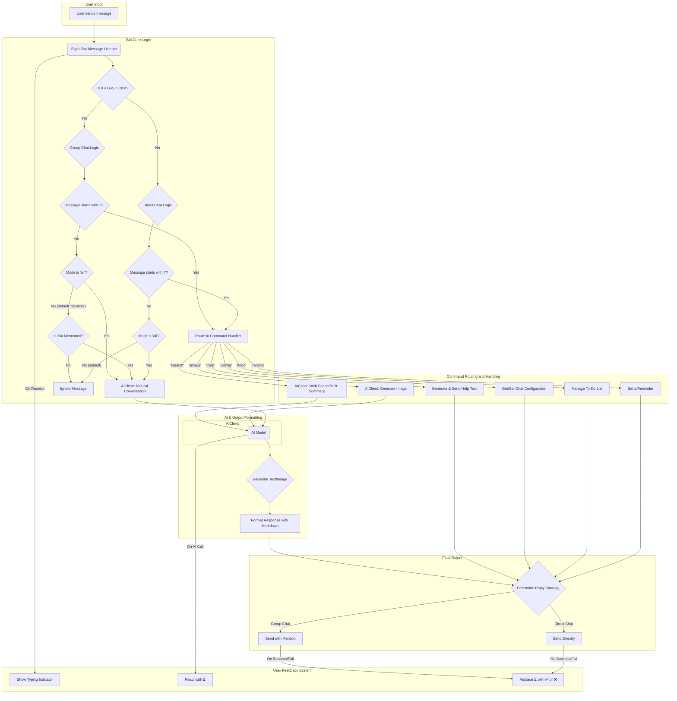

# Bot Interaction and Command Flow

This document provides a technical specification for the user-bot interaction flow, command handling, and conversational context management. The system is designed around a command-driven interface, where all interactions are initiated with a `!` prefix.

## Visual Flowchart

The following diagram illustrates the lifecycle of a user's message, from input to the bot's final response.

## Core Logic & Context Management

The bot's response logic depends on the chat type (direct or group) and the configured interaction `mode`.

### 1. Logic for Direct Chats (One-on-One)

- **Default Behavior:** The bot will **only** respond to messages that start with the `!` command prefix. All other messages are ignored.
- **`!config set mode all`:** When this mode is enabled, the bot will respond to **all** messages. If a message does not start with `!`, it is treated as a natural language query and sent to the AI.

### 2. Logic for Group Chats

- **Default Mode (`mention`):**
  - The bot will **always** respond to any message that starts with the `!` command prefix, regardless of whether it is mentioned.
  - For non-command messages, the bot will only respond if it is **explicitly mentioned**. These messages are treated as natural language queries.
- **`!config set mode all`:**
  - When this mode is enabled, the bot will respond to **all** messages in the group, whether they are `!` commands or not. Non-command messages are treated as natural language queries.

### 3. Message Parsing and Routing

- After the logic gate above determines that a message should be processed, the `MessageHandler` checks if it starts with `!`.
- If it does, the command is routed to the appropriate handler.
- If it does not (and the mode allows it), the message is routed to the `AIClient` for a conversational response.

### 2. Reply Strategy

The bot adapts its reply mechanism based on the chat context, determined by checking the `message.group` attribute.

- **Group Chats (`message.group` is not `None`):** The bot will default to a **mention-reply**. This ensures the response is clearly directed at the user who issued the command.
- **Direct Chats (`message.group` is `None`):** The bot will use a **standard reply**, as the context is implicitly one-on-one.

### 3. Context Model: "Simple Log"

For each chat, the bot maintains a `Context` object with two key attributes:

- **`history`**: A rolling log of the last 20 messages relevant to bot interaction.
- **`config`**: Chat-specific settings (`model`, `prompt`, etc.), managed by the `PersistenceManager`.

When a command requires conversational context (e.g., a follow-up question to a `!search` command), the `history` log is passed to the AI model.

## Command Reference

All commands must be prefixed with `!`.

- **`!help`**

  - **Purpose:** Displays the help message.
  - **Example:** `!help`

- **`!config`**

  - **Purpose:** Manages chat-specific settings.
  - **Subcommands:**
    - `view`: Shows the current settings.
    - `set <key> <value>`: Sets a configuration key.
      - `mode`: Controls the bot's conversational behavior.
        - `all`: Responds to all messages (commands and natural language).
        - `mention`: In groups, responds to all `!` commands but only responds to natural language when mentioned. (This is the default group mode).
  - **Examples:**
    - `!config set model gemini-1.5-pro`
    - `!config set mode mention`

- **`!todo`**

  - **Purpose:** Manages a shared to-do list.
  - **Subcommands:** `add <item>`, `list`, `done <index>`
  - **Example:** `!todo add Finalize the Q3 report`

- **`!remind`**
  - **Purpose:** Sets a reminder.
  - **Example:** `!remind me in 10 minutes to check the build`

## Onboarding Flow

When added to a group, the bot introduces itself with instructions on how to use commands.

> **Bot (upon joining a group):**
>
> > Hello everyone. I am a helpful assistant.
> >
> > You can interact with me by sending a message starting with `!`.
> >
> > To see a full list of what I can do, just type:
> > `!help`

## User Feedback System

A three-stage feedback system provides real-time updates for any AI-related task:

1.  A **typing indicator** is shown when a command message is received.
2.  A `⏳` reaction is added to the user's message when the AI call is initiated.
3.  The `⏳` reaction is replaced with `✅` on success or `❌` on failure.

## Technical Implementation Blueprint

### 1. Persistence Layer: TinyDB

- **Database File:** `data/db.json`
- **Implementation:** The `PersistenceManager` class will encapsulate all TinyDB logic, using `CachingMiddleware` for performance. It will handle CRUD operations for chat configurations, to-do lists, and other persistent data.

### 3. AI Cost Optimization: "Intelligent Summarizer"

- **Context Management:** Each chat context will maintain a `conversation_log` (short-term) and a `conversation_summary` (long-term).
- **Summarization Task:** A scheduled background job will use a cost-effective model (e.g., Gemini Flash) to periodically summarize the `conversation_log` into the `conversation_summary` and clear the log.
- **Optimized Prompts:** AI-driven commands will receive a prompt containing the long-term summary and the most recent messages, minimizing token usage.
