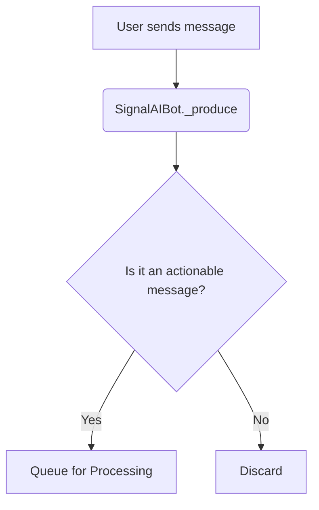
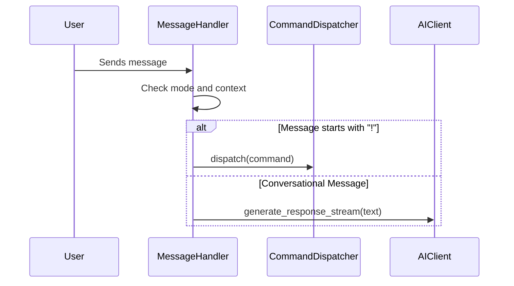

# Technical Documentation: Signal AI Bot

This document provides a comprehensive technical specification of the Signal AI Bot, detailing its architecture, data flow, and core components. The documentation is structured as a narrative, following a message from its reception to the bot's final response, augmented with diagrams and structured metadata for clarity and AI-driven analysis.

## 1. A Message Arrives: The Entry Point

The journey begins when a user sends a message. The `SignalAIBot` class, inheriting from `SignalBot`, is the primary listener. Its overridden `_produce()` method acts as the first line of processing.



### Advanced Message Filtering

Before any significant processing occurs, the `_produce()` method applies a crucial filtering layer to prevent the bot from acting on non-essential or recursive signals.

- **Ignored Message Types:**
  - **Typing Indicators (`typingMessage`):** These are purely informational and contain no user content.
  - **Read Receipts (`receiptMessage`):** These confirm message delivery and are not part of the conversation.
  - **Echoes (`syncMessage` with `sentMessage`):** When the bot sends a message from a linked device, the signal service echoes it back. This filter prevents the bot from responding to its own messages.

This intelligent filtering ensures that only genuine user-generated content proceeds to the main logic gate.

## 2. The Logic Gate: To Process or Not?

Once a message is deemed actionable, it is passed to the `MessageHandler`. This class is the brain of the bot, deciding whether a response is warranted.

```yaml
component:
  name: MessageHandler
  path: src/signal_ai/core/message_handler.py
  responsibilities:
    - "Apply interaction logic based on chat mode (mention, all, quiet)"
    - "Route messages to CommandDispatcher (for commands) or AIClient (for conversation)"
  dependencies:
    - "CommandDispatcher"
    - "PersistenceManager"
    - "AIClient"
```

The handler's primary function is to consult the chat's specific configuration, managed by the `PersistenceManager`.

- **Direct Chats:**
  - **Default:** Responds only to messages starting with `!`.
  - **Mode `all`:** Responds to all messages.
- **Group Chats:**
  - **Default (`mention`):** Responds to `!` commands or when the bot is explicitly mentioned (`@BotName`).
  - **Mode `all`:** Responds to every message in the group.
  - **Mode `quiet`:** Never responds.

## 3. Routing: Command or Conversation?

If the logic gate allows the message to pass, the `MessageHandler` inspects its content to determine its nature.



### A. Command Handling (`!`)

If the message begins with `!`, it is routed to the `CommandDispatcher`.

```yaml
component:
  name: CommandDispatcher
  path: src/signal_ai/core/dispatcher.py
  responsibilities:
    - "Dynamically discover and register all command classes"
    - "Parse command strings and execute the appropriate command"
```

The dispatcher features an **automatic discovery mechanism**. On initialization, it scans the `src/signal_ai/commands/` directory, identifies all classes that inherit from `BaseCommand`, and registers them in a dictionary, mapping the command name (e.g., `"help"`) to the class instance. This makes the bot highly extensible; adding a new command is as simple as creating a new file with a `BaseCommand` subclass.

### B. Conversational Handling

If the message is not a command, it is treated as a natural language query and routed to the `AIClient` for a conversational response.

## 4. The Response: Generation and Delivery

### A. AI-Powered Responses

The `AIClient` handles all interactions with the Gemini AI model. For conversational queries, it uses a streaming approach for a responsive user experience.

1.  **"Thinking..." Notification:** The bot immediately sends a "Thinking..." message to acknowledge the query.
2.  **Streaming and Editing:** As the AI generates the response in chunks, the bot progressively **edits** the "Thinking..." message. This avoids long waits and shows the response as it's being formulated.
3.  **Formatting:** Before sending, the response is passed through the `cleanup_signal_formatting` utility, which converts Markdown code blocks and standardizes formatting for optimal display in the Signal app.

### B. Context Management

To maintain conversational context, the `PersistenceManager` stores a rolling `history` of the last 50 user and model interactions for each chat. This history is passed to the `AIClient` with each new query, allowing for follow-up questions and a coherent dialogue.

## 5. Technical Implementation Blueprint

### Core Components

- **`SignalAIBot` (`bot.py`):** The main application class. It orchestrates all other components and contains the initial message filtering logic.
- **`MessageHandler` (`message_handler.py`):** The central hub that applies the interaction logic gate and routes messages.
- **`CommandDispatcher` (`dispatcher.py`):** The engine for the modular command system, featuring automatic discovery.
- **`AIClient` (`ai_client.py`):** The dedicated interface for all communication with the Gemini AI model.
- **`PersistenceManager` (`persistence.py`):** The abstraction layer for the TinyDB database, managing all persistent data like chat configurations and history.
- **`PromptManager` (`prompt_manager.py`):** A utility for loading and formatting prompts sent to the AI.
- **`GroupManager` (`group_manager.py`):** A component responsible for handling group-specific logic and events.
