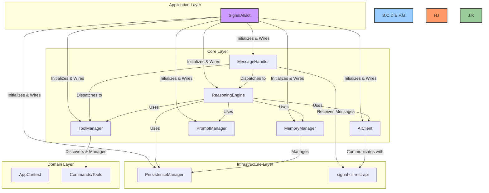
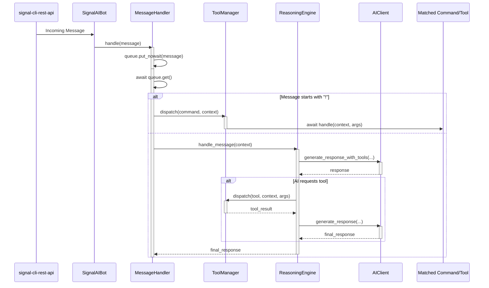

# Signal AI Technical Architecture

## 1. Overview

This document provides a precise, 1:1 technical blueprint of the `signal-ai` library's architecture. The system is designed as a modern, service-oriented, and dependency-injected framework. Its core principles are simplicity, modularity, testability, and scalability, ensuring that each component has a single, well-defined responsibility.

This architecture is built to be processed by an agentic AI, with clear separation of concerns and minimal ambiguity.

---

## 2. System Architecture

The architecture is composed of four distinct layers: Application, Core, Infrastructure, and Domain. This layered approach ensures a clean separation of concerns, making the system easier to understand, maintain, and extend.

---

## 3. Incoming Message Data Flow

The following sequence diagram illustrates the precise, non-blocking flow for handling a new message received from the `signal-cli-rest-api`.

---

## 4. Core Component Specifications

### 4.1. Domain Layer

- **Description:** Contains the core data structures and commands of the application.
- **Key Files:**
  - `src/signal_ai/core/context.py`: Defines the `AppContext` model.
  - `src/signal_ai/commands/`: Contains all the available commands/tools.

### 4.2. Infrastructure Layer

- **Description:** Handles all external communication and low-level concerns, such as database interactions and API calls.
- **Key Files:**
  - `src/signal_ai/core/persistence.py`: Defines the `PersistenceManager` for database interactions.

### 4.3. Core Layer

- **Description:** Contains the core business logic of the application, orchestrating data and operations between the domain and infrastructure layers.
- **Key Files:**
  - `src/signal_ai/core/message_handler.py`: The central component for receiving and dispatching messages.
  - `src/signal_ai/core/reasoning_engine.py`: The brain of the AI, orchestrating the interaction between the user, the AI model, and the available tools.
  - `src/signal_ai/core/tool_manager.py`: Discovers and manages all available tools.
  - `src/signal_ai/core/ai_client.py`: A client for interacting with the AI model.
  - `src/signal_ai/core/prompt_manager.py`: Manages the prompts used by the AI model.
  - `src/signal_ai/core/memory_manager.py`: Manages the short-term and long-term memory of the AI.

### 4.4. Application Layer

- **Description:** The entry point of the application, responsible for initialization, configuration, and starting the main processes.
- **Key Files:**
  - `src/signal_ai/bot.py`: The main application class for the Signal AI Bot.
